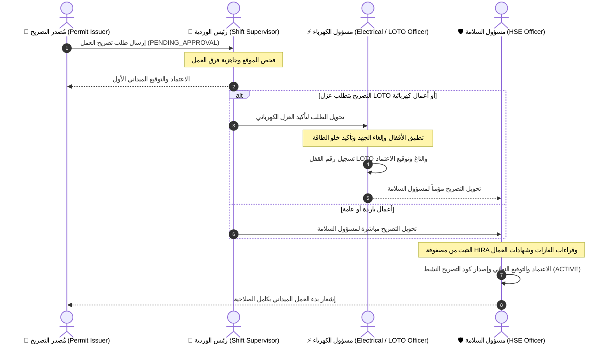
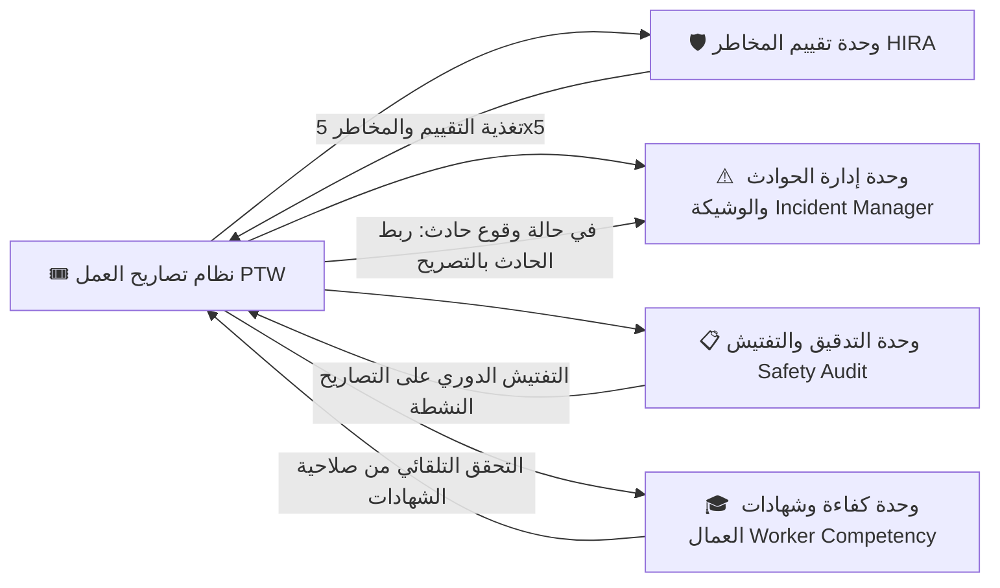

# 📐 المخطط الشامل والمهيكلي لنظام تصاريح العمل الموحد (PTW System Architecture & Workflow)

يقدم هذا المستند دليلاً تفصيلياً ومخططاً انسيابياً متكاملاً (Flowchart) يشرح دورة حياة تصريح العمل، الربط التفاعلي بين الخطوات، تسلسل التوقيعات الرقمية، وإجراءات السلامة الميدانية وفق معايير **OSHA & ISO 45001 & NEBOSH**.

---

## 1. 🔄 المخطط الانسيابي العام لدورة حياة تصريح العمل (Master Permit Workflow Chart)

```mermaid
flowchart TD
    classDef startEnd fill:#f9f,stroke:#333,stroke-width:2px,color:#000;
    classDef stepNode fill:#e1f5fe,stroke:#0288d1,stroke-width:2px,color:#01579b;
    classDef decisionNode fill:#fff3e0,stroke:#f57c00,stroke-width:2px,color:#e65100;
    classDef approvalNode fill:#e8f5e9,stroke:#388e3c,stroke-width:2px,color:#1b5e20;
    classDef dangerNode fill:#ffebee,stroke:#d32f2f,stroke-width:2px,color:#b71c1c;

    Start([🟢 بدء العمل: اختيار نوع التصريح]) :::startEnd --> Step1

    subgraph Phase1 ["الخطوة الأولى: إعداد وإنشاء المسودة (Permit Creation Wizard)"]
        Step1["📝 الخطوة 1: تفاصيل العمل والموقع"] :::stepNode --> Step1_Check{هل يوجد تقييم HIRA معتمد؟}
        Step1_Check -- نعم --> Step1_AutoFill[تعبئة المخاطر والعنوان تلقائياً من HIRA] :::stepNode
        Step1_Check -- لا --> Step1_Internal[تحديد التقييم الداخلي للتصريح] :::stepNode
        
        Step1_AutoFill --> Step2
        Step1_Internal --> Step2
        
        Step2["✅ الخطوة 2: قوائم التحقق الميدانية OSHA"] :::stepNode --> Step2_Logic[تنشيط القوائم تفاعلياً حسب نوع التصريح والمخاطر] :::stepNode
        Step2_Logic --> Step3
        
        Step3["🛡️ الخطوة 3: تقييم المخاطر 5x5 HIRA - ISO 45001"] :::stepNode --> Step3_Details[إدخال الاحتمالية والشدة + الهرم الرقابي للتحكم + قراءات الغازات LEL/O2/H2S] :::stepNode
        Step3_Details --> Step4
        
        Step4["👥 الخطوة 4: فريق العمل ومعدات الوقاية PPE"] :::stepNode --> Step4_Check[إضافة العمال والتحقق من شهادات الصلاحية ومعدات الوقاية] :::stepNode
        Step4_Check --> Step5
        
        Step5["✒️ الخطوة 5: التوقيعات الرقمية المبدئية"] :::stepNode --> Step5_Sign[توقيع مُصدر التصريح + توقيع مشرف العمل] :::stepNode
    end

    Step5_Sign --> SubmitCheck{هل البيانات مكتملة بالتوقيعات؟}
    SubmitCheck -- لا --> Step5
    SubmitCheck -- نعم --> PendingState[🟡 إرسال الطلب: حالة التصريح (PENDING_APPROVAL)] :::decisionNode

    subgraph Phase2 ["الخطوة الثانية: سلسلة الاعتمادات والتوقيعات الرسمية (Approval Hierarchy)"]
        PendingState --> AreaBossApprove{1. موافقة رئيس الوردية / مسؤول المنطقة} :::decisionNode
        AreaBossApprove -- رفض --> RejectedState[🔴 حالة التصريح (REJECTED)] :::dangerNode
        AreaBossApprove -- موافقة --> CheckLOTO{هل التصريح يشتمل على أعمال كهرباء أو عزل LOTO؟}
        
        CheckLOTO -- نعم --> ElecOfficerApprove["⚡ 2. توقيع مسؤول الكهرباء والعزل"] :::approvalNode
        ElecOfficerApprove --> LotoForm["🔒 ملء بيانات عزل الطاقة (رقم القفل، مفتاح LOTO، طريقة العزل)"] :::stepNode
        LotoForm --> SafetyOfficerApprove
        
        CheckLOTO -- لا --> SafetyOfficerApprove["🛡️ 3. اعتماد وتوقيع مسؤول السلامة HSE"] :::approvalNode
        SafetyOfficerApprove -- رفض --> RejectedState
    end

    SafetyOfficerApprove -- موافقة واسناد رقم نهائي --> ActiveState[🟢 حالة التصريح: (ACTIVE / APPROVED)] :::approvalNode

    subgraph Phase3 ["الخطوة الثالثة: التنفيذ الميداني والإغلاق (Execution & Handback)"]
        ActiveState --> FieldWork[👷 بدء تنفيذ الأعمال الميدانية تحت المراقبة] :::stepNode
        FieldWork --> EmergencyCheck{هل حدث طارئ أو خطر داهم؟}
        
        EmergencyCheck -- نعم --> SuspendPermit[⚠️ تعليق التصريح فوراً (SUSPENDED)] :::dangerNode
        SuspendPermit --> Rectify[تصحيح الأوضاع والتفتيش] :::stepNode
        Rectify --> ActiveState
        
        EmergencyCheck -- لا --> WorkComplete{هل تم انتهاء الأعمال الميدانية؟}
        WorkComplete -- نعم --> HandbackStep["🧹 تسليم الموقع: إزالة أقفال LOTO + تنظيف المكان + فحص السلامة"] :::stepNode
        HandbackStep --> FinalSignatures["✒️ توقيع الاستلام والإغلاق النهائي من الطرفين"] :::approvalNode
        FinalSignatures --> ClosedState[⬛ حالة التصريح النهائية: (CLOSED / MOGHLAQ)] :::startEnd
    end
```

---

## 2. 📑 شرح تفصيلي لترابط الخطوات الخمسة بداخل نموذج الإنشاء (Permit Creation Wizard)

| رقم الخطوة | اسم الخطوة في النظام | البيانات المدخلة والمطلوبة | الربط والتأثير المباشر على الخطوات التالية |
| :--- | :--- | :--- | :--- |
| **الخطوة 1** | **تفاصيل العمل والموقع** | - عنوان التصريح ونوعه (ساخن/بارد/كهرباء/ارتفاع...)<br>- موقع العمل بالتفصيل<br>- الأجهزة والمعدات المستخدمة<br>- ربط تقييم HIRA معتمد أو تحديد تقييم داخلي | - **يحدد نوع التصريح المختار** ما إذا كانت قائمة فحص الغازات ستظهر في الخطوة 3 أم لا.<br>- عند ربط تقييم HIRA معتمد، يتم تعبئة المخاطر المترتبة تلقائياً في الخطوة 3. |
| **الخطوة 2** | **قوائم التحقق الميدانية (OSHA)** | - اختيار قوائم التحقق المطلوبة (السلامة العامة، عزل LOTO، الأماكن المغلقة، الأعمال الساخنة). | - عند اختيار/إلغاء أي قائمة من الأعلى، تظهر أو تختفي قائمة الفحص التفصيلية الخاصة بها بالأسفل فوراً وبشكل ديناميكي. |
| **الخطوة 3** | **تقييم المخاطر (HIRA - ISO 45001)** | - تحديد المخاطر المتوقعة بموقع العمل.<br>- تطبيق مصفوفة الخطر 5x5 (الاحتمالية × الشدة = الخطر الأولي).<br>- إدخال الهرم الرقابي للتحكم (الإزالة، الاستبدال، التحكم الهندسي، التحكم الإداري، PPE).<br>- احتساب الخطر المتبقي.<br>- إدخال قراءات الغازات (LEL / O2 / H2S) في حالة العمل الساخن أو الأماكن المغلقة. | - يحدد مستوى الخطر المتبقي ما إذا كان التصريح آمناً للاعتماد.<br>- إدخال قراءات الغازات شرط أساسي للموافقة في الأعمال الساخنة والمغلقة.<br>- يربط تدابير الوقاية بمتطلبات معدات PPE للعمال في الخطوة 4. |
| **الخطوة 4** | **فريق العمل والوقاية (PPE)** | - اختيار العمال من قائمة الكفاءات المعتمدة أو إضافة عمال المقاولين الخارجيين.<br>- التثبت من صلاحية شهادات العمال (LOTO, Hot Work, Confined Space).<br>- اختيار معدات الحماية الشخصية PPE المطلوبة. | - يفحص النظام تلقائياً تاريخ صلاحية الشهادات؛ في حالة انتهاء الشهادة، يظهر تنبيه باللون الأحمر.<br>- تظهر عدد المعدات والعمال في ملخص المراجعة النهائية في الخطوة 5. |
| **الخطوة 5** | **التوقيعات الرقمية والراجعة** | - توقيع مُصدر التصريح (تلقائي بحساب المستخدم).<br>- توقيع مشرف العمل الاستلام الميداني.<br>- مراجعة ملخص التصريح الشامل قبل الإرسال. | - عند كبس زر "إرسال التصريح"، يتم تغيير الحالة إلى `PENDING_APPROVAL` وإشعارات المسؤولين للاعتماد الرسمية. |

---

## 3. 🔒 مخطط سلسلة الاعتمادات والعزل الكهربائي (Approval & LOTO Flowchart)



---

## 4. 📊 مصفوفة الصلاحيات حسب الأدوار (Role-Based Access Control Matrix)

| الدور الوظيفي (Role) | إنشاء التصريح | التوقيع كـ مشرف | توقيع عزل LOTO | اعتماد السلامة HSE | إغلاق وتسليم التصريح |
| :--- | :---: | :---: | :---: | :---: | :---: |
| **منفذ العمل / العامل (Worker)** | ❌ | ❌ | ❌ | ❌ | ❌ |
| **مُصدر التصريح / المشرف (Issuer / Supervisor)** | ✅ | ✅ | ❌ | ❌ | ✅ |
| **رئيس الوردية / مسؤول المنطقة (Shift Boss)** | ✅ | ✅ | ❌ | ❌ | ✅ |
| **مسؤول الكهرباء والعزل (LOTO Officer)** | ✅ | ❌ | ✅ | ❌ | ✅ |
| **مسؤول السلامة والصحة المهنية (HSE Officer)** | ✅ | ✅ | ✅ | ✅ | ✅ |
| **مدير النظام (Admin)** | ✅ | ✅ | ✅ | ✅ | ✅ |

---

## 5. 🛠️ الموديولات المساعدة والمترابطة بالنظام (Auxiliary System Modules)



---

## 💡 خلاصة ونقاط الربط التكاملي:
1. **الربط التفاعلي الفوري**: أي تغيير في خطوة ينعكس تلقائياً على الخطوات التالية (مثل اختيار نوع التصريح الذي ينشط فحص الغازات أو قوائم OSHA المناسبة).
2. **الأمان متعدد المستويات**: لا يمكن صدور أي تصريح نشط دون توقيعات الأطراف الثلاثة (المُصدر، المسؤول الميداني، ومسؤول السلامة HSE).
3. **التوثيق الرقمي الراجع**: جميع التغييرات والتوقيعات تسجل بطابع زمني فريد (Timestamp) ورقم تسلسلي غير قابل للتعديل للحفاظ على أعلى معايير الحوكمة والامتثال القانوني.
